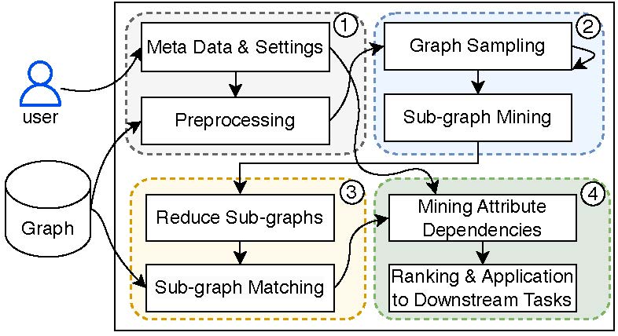

# README
## Discovering Graph Differential Dependencies 
Graph differential dependencies (GDDs) provide a primitive form of integrity constraints to specify a fundamental part of the semantics of the data, which plays a key role in entity resolution. 
While several approaches for GED mining have been developed, existing methods cannot handle GDD mining efficiently. 
In this paper, we propose a novel GDD mining approach combining graph partitioning, frequent graph pattern mining, redundancy removal of graph patterns, homomorphic subgraphs matching, and differential dependency mining.
We implement the graph pattern mining and GDD mining respectively and simplify graph patterns and data graphs to improve its efficiency. 
Using real-life and synthetic datasets and comparing with the state-of-the-art approach of GDD mining, we experimentally verify the efficiency of the algorithm.

## System Requirements
- Java 1.8
- Python 3

## Python Dependencies
- pandas
- glob
- itertools
- Levenshtein
- multiprocessing

## Execution Steps
We divide the GDD mining process into the following three steps: 
1. **Frequent Subgraph Mining**:
   - input data in folder: `resource/`
   - output data in the folder: `test/process_1_producer/queryGraph`
   - run command: `java -jar GraMi_ExactSubgraphMatching-1.0-SNAPSHOT.jar filename=graph.lg datasetFolder=resource/ freq=20`
   - parameter: `filename` refers to the target graph data file, `datasetFolder` indicates the folder where the graph data is located, `freq` set frequency threshold.
